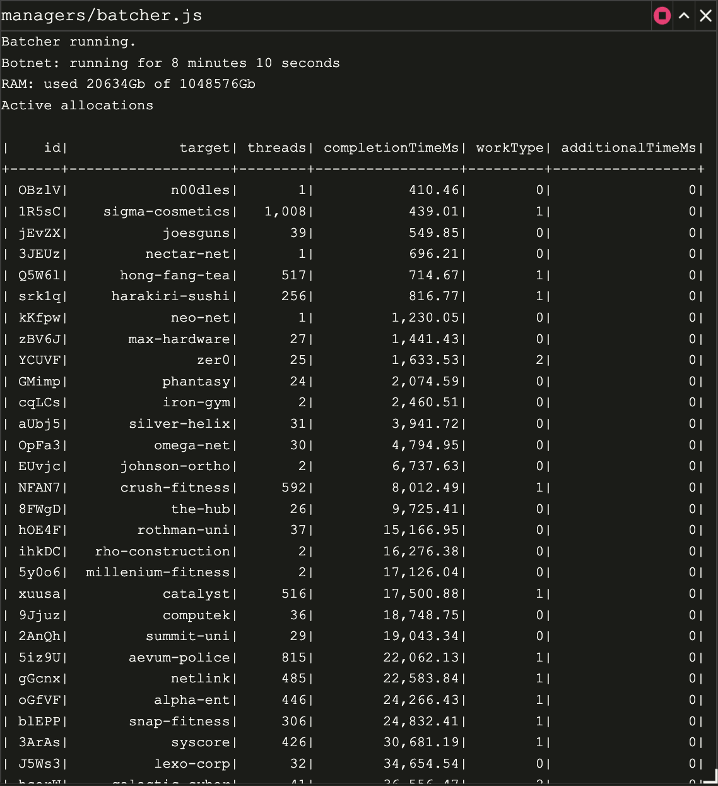

# BitBurner scripts to rule the world

Note: Based on https://github.com/bitburner-official/typescript-template

## How to use scripts

(please note, all scripts are .js in the game and compiled from .ts)

`run_all.js` starts all required processes to manage the system
* nuker.js - this script will try to scan and hack servers as soon as you get enough hacker power and have all the tools
* nodeupgrader.js - this script will buy and upgrade hacknet nodes for you
* serverbuyer.js - script will buy and upgrade servers. *caution* during upgrades it will kill all processes to delete and add the server with upgraded capacity.
* batcher.js - the core of the system, will run a simple WGH batch using either botnet of bought servers or hacked servers.

## WGH 

The algorithm is simple:

* score nodes based on `maxMoney * growthRate / (growTime + weakenTime) / minSecurity`
* decide an action:
  * if security is not at lowest - weaken
  * if money is not at the lowest - grow
  * once we have low security and all the money - hack for about 60% of the money
* once action it choosen - find enough RAM to run required script among the botnet

## Utility

* util/analyse.js - script to show some insights on scoring
* util/find-to-backdoor.js - prints out commands to backdoor any server including whole path of connects
* util/rm-all-hosts.js - used to clean all machines from scripts - used to upgrade scripts
* util/rm-all.js - does cleanup on a single host

